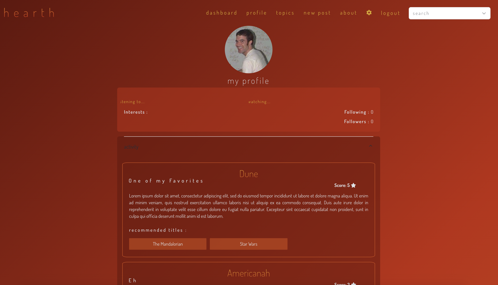
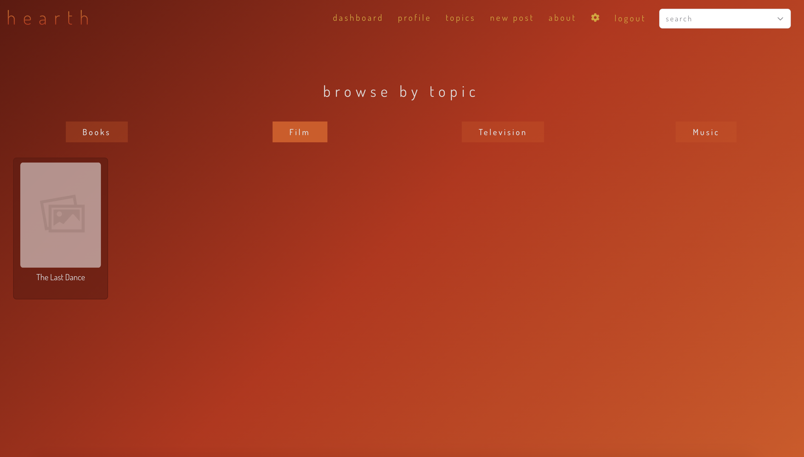
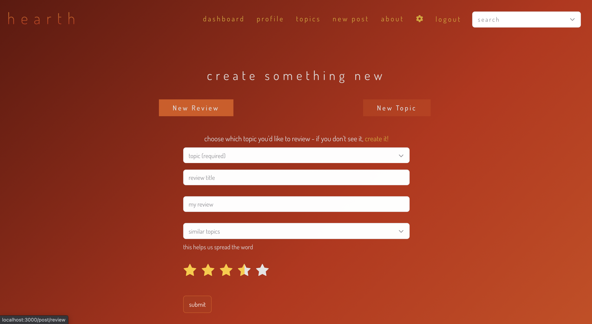
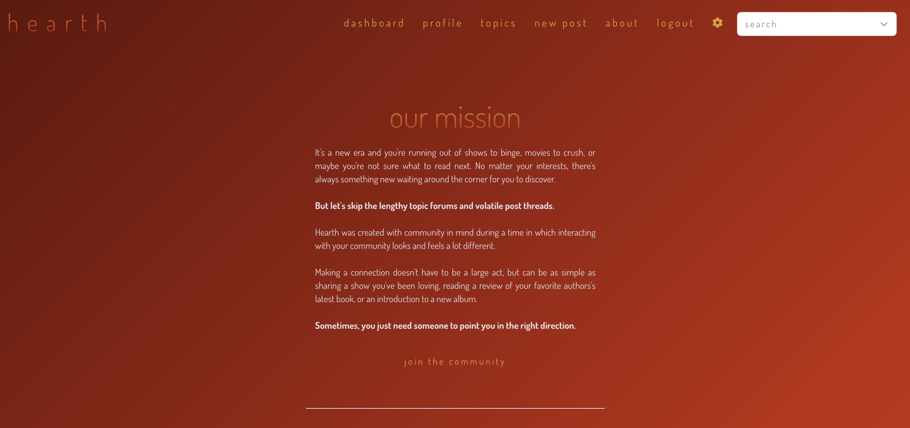

<p align="center">

</p>

---

Designed with community in mind, hearth allows users to rate, review and find something worth reading, listening or watching almost instantly.

[Check out the deployed site here](https://hearthcommunity.netlify.app)

## Table of Contents

- [User Story](#user-story)
- [Installation](#installation)
- [Technology](#technology)
- [Functionality](#functionality)
- [Future Developments](#future-developments)
- [Links and Screenshots](#links-and-screenshots)
- [Created By](#created-by)
- [License](#license)

## User Story

The average person takes 23 minutes to find something to watch on Netflix and over 7 minutes picking out their next movie. With more time to watch, read and listen than ever before, we have developed an app that allows users to skip the long review threads and answer the question "What's next?" more quickly.

```
AS an individual, I would like to find something to watch, read or listen.
I WANT to be able to make a decision quickly.
AND find a topic with good reviews/ratings.
SO I find something to stream or read in a timely manner.

```

## Installation

To use this project, first clone the repo in your terminal using the command below:

```
$ git clone https://github.com/neylonmc/Hearth.git
```

Once the repo is cloned, run the following command:

```
$ npm i
```

To start the server, run the following command:

```
$ npm start
```

## Technology

### APIs and Libraries

- React
- MongoDB
- Animate.css
- React Suite
- Google Login
- IMDB API
- OpenLibrary
- Random User API

## Functionality

```
GIVEN a login page, I use my Google account to login in.
THEN I am presented with my dashboard.
WHEN I click "profile", I am redirected to my profile page.
THEN when I click "topics", I can browse the different topics in the app.
WHEN I click “new post", I am presented with three different choices.
THEN I fill out the corresponding information based on which choice I click.
WHEN I click “submit”, the review, topic or poll will be available for others.
WHEN I click "about", I am presented with information about hearth.
THEN I can logout if I would no longer like to be logged in to the app.
WHEN I click the settings icon, I have the ability change preferences.
THEN I am able to save these preferences for my account.
WHEN I want to quickly find a topic, I can search in the search bar.
SO I can find something to watch, read or listen to quickly and efficiently.

```

## Future Developments

### More Topics

**Allow users to be able to search and review more topics**

Building a larger community through hearth is our ultimate goal. Allowing users to find more topics such as crafts, kid friendly activities, or fun outdoor parks would be ideal. This way, hearth could reach a larger audience and have topics for everyone.

### Where To Stream Or Buy

**Allow users to be able to see where they can stream shows, music or buy a book**

Browsing reviews is an easy way to find something to keep yourself entertained quickly. But do you have that streaming service or is it on Amazon Prime? This information will allow users to stream, read and listen to topics even quicker.

### Create An Account

**Allowing users to create an account through the application instead of through Google.**

Allowing users to create an account through hearth. Easier way to save preferences, get notifications and make the application more tailored to the user.

## Links and Screenshots

Repo: https://github.com/neylonmc/Hearth

Deployed App: https://hearthcommunity.netlify.app

Login Page:


Dashboard:


Profile:



Topics:



New Post:



About:



## Created by

- [Elisabeth Clumpkens](https://github.com/eaclumpkens "Visit Elisabeth's GitHub")
- [Dylan Frank](https://github.com/drfrank22 "Visit Dylan's GitHub")
- [Joseph Gill](https://github.com/jaguar6105 "Visit Joseph's GitHub")
- [Meaghan Neylon](https://github.com/neylonmc "Visit Meaghan's GitHub")

## License

[](https://opensource.org/licenses/MIT)

```

```
